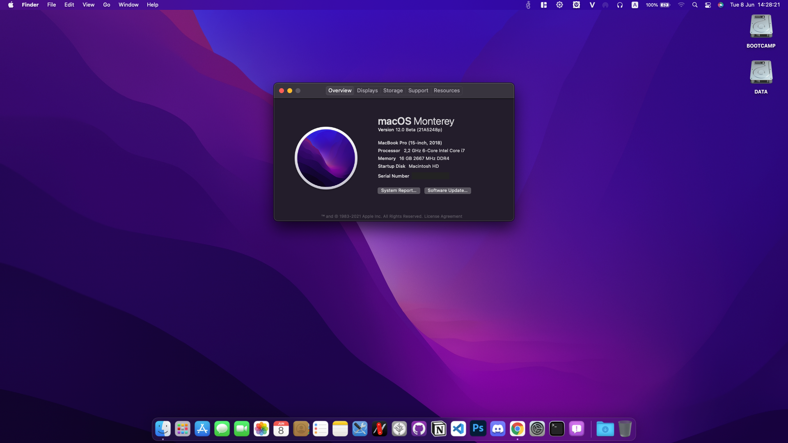

# Dell Inspiron G7 7588 Hackintosh


- macOS: 
  - Big Sur 11.4 ✅
  - Catalina 10.15.7 ✅
  - Mojave 10.14.6 ✅
- Bootloader: OpenCore 0.7.0, Clover 5136
- EFI can be used for both for installation and booting from SSD.

## 🔍 System Overview
* Dell G7 7588
    * CPU: i7-8750H
    * RAM: 2 x 8GB DDR4 (upgraded)
    * Display: BOE NV156FHM 1080p 144Hz (upgraded)
    * SSD:
        * NVMe SSD Western Digital SN730 256GB for macOS and Windows
        * SATA HDD Western Digital Black 500GB for Data
    * Sound: Realtek ALC256
    * Wireless + Bluetooth: Replaced with DW1560 (BCM94352Z chipset)
    * VGA: Nvidia GTX 1050Ti (disabled)
    * BIOS: 1.15.0 (latest)

## ℹ️ Current Status

| Feature | Status |
| ------------- | ------------- |
| CPU Power Management | ✅ Working |
| Sleep/Wake | ✅ Working |
| Intel UHD630 Graphics Acceleration | ✅ Working |
| Intel Quartz Extreme and Intel Core Image (QE/CI) | ✅ Working |
| Brightness control slider | ✅ Working |
| Special function keys (audio, brightness, sleep...) | ✅ Working |
| Ethernet | ✅ Working |
| Audio | ✅ Working |
| USB-C Port | ✅ Working |
| Touchpad | ✅ Working |
| Battery | ✅ Working |
| iMessage/Facetime and App Store | ✅ Working  |
| Speakers and Headphones | ✅ Working |
| Built-in Microphone | ✅ Working |
| Webcam | ✅ Working |
| Wi-Fi/Bluetooth | ✅ Working |
| Airdrop/Handoff | ✅ Working |
| FileVault 2 (OpenCore recommended)| ✅ Working |
| SD Card | ❌ Not working |
| Hibernation | ❌ Not working |
| NVIDIA GPU/HDMI Port | ❌ Not working |
| DRM | ❌ Not working |
| Fingerprint reader | ❌ Not working |
| BootCamp | ❌ Not working |

## 💾 Installation

### BiOS Configuration
* Recommend you should restore the BIOS setting to Factory Setting first. Then configure the following things: 
    - UEFI Boot Path Security: **Never**
    - SATA Operation: **AHCI**
    - Enabled USB Boot Support: **Enabled**
    - Enable External USB Port: **Enabled**
    - Thunderbolt Security: **No Security**
    - Thunderbolt Auto Switch: **Native Enumeration**
    - PTT Security: **Disabled**
    - Secure Boot Enable: **Disabled**
    - Intel SGX: **Disabled**
    - VT for Direct I/O: **Disabled**
    - Wake on USB: **Disabled**
    - Auto OS Recovery Threshold: **Disabled**
    - SupportAssist OS Recovery: **Disabled**

## 🛠 Hardware
This section talks about configuring the EFI folder for the hardware.

### Audio
* For ALC256 on this G7, I use `layout-id = <0E000000>`, it means `14`.
* Without any modifications, the headphone jack is buggy. External microphones aren't detected and the audio output may randomly stop working or start making weird noises. To permanently fix this issue, please go to [Post-Install](https://github.com/rex-lapis/Dell_G7_7588_OpenCore_Hackintosh#tweaks) for more information.
#### Fix audio broken after rebooting from Windows into macOS
* DeviceProperties/Add/PciRoot(0x0)/Pci(0x1F,0x3)
  * `alctsel = <01000000>`

### Wi-Fi/Bluetooth
* The stock Intel AC 9560 now can be worked well with [OpenIntelWireless](https://github.com/OpenIntelWireless), but it is not stable at all. So I replaced it with the Dell DW1560 card.
  * Note: This EFI can work well with Intel card, so you don't need to worry much.
* If you have DW1820a card, it is worked too. But trust me, you don't want to use that card! The Wi-Fi speed is a bit slower and has problems with some 5GHz networks. Bluetooth sometimes has issues too.

### Graphic Display
* Integrated Intel UHD Graphics 630 support is handled by WhateverGreen, and configured in the `DeviceProperties` section of `config.plist`.
The NVIDIA GPU is not supported so it is disabled in SSDT.
The default BIOS DVMT pre-alloc value of `64MB` is sufficient and does not need to be changed.
#### Enable acceleration
* DeviceProperties/Add/PciRoot(0x0)/Pci(0x2,0x0)
  * `AAPL,ig-platform-id = <0900A53E>`
#### Fix backlight registers on CoffeeLake platform
* DeviceProperties/Add/PciRoot(0x0)/Pci(0x2,0x0)
  * `enable-backlight-registers-fix = <01000000>`
#### Enable external display support
* DeviceProperties/Add/PciRoot(0x0)/Pci(0x2,0x0)
  * `agdpmod = <vit9696>`

### Sleep, Wake and Hibernation
* Hibernation is not supported on a Hackintosh and everything related to it should be completely disabled. Disabling additional features prevents random wakeups while the lid is closed. After every update, these settings should be reapplied manually.
```
sudo pmset -a hibernatemode 0
sudo rm -f /var/vm/sleepimage
sudo mkdir /var/vm/sleepimage
sudo pmset -a standby 0
sudo pmset -a autopoweroff 0
sudo pmset -a powernap 0
sudo pmset -a proximitywake 0
```
* Sleep and wake are improved and very fast now. Also, you can use shortcut key `Fn + Insert` to sleep this machine, likes Windows. For more infomation, please check the [OpenCore 0.6.8](https://github.com/rex-lapis/Hackintosh-Dell-G7-7588-OpenCore/blob/main/Changelog.md#v068) changelog.

### CPU Performance
* CPU power management is done by `CPUFriend.kext` while `CPUFriendDataProvider.kext` defines how it should be done. `CPUFriendDataProvider.kext` is generated for a specific CPU and power setting. The one supplied in this repository was made for the i7-8750H. In case you have another CPU, you can use [one-key-cpufriend](https://github.com/stevezhengshiqi/one-key-cpufriend) to generate your own `CPUFriendDataProvider.kext`.

### iMessage/Facetime and App Store
* To use iMessage and other Apple services, you need to generate your own serial numbers. This can be done using [CorpNewt's GenSMBIOS](https://github.com/corpnewt/GenSMBIOS). Make sure model is `MacBookPro15,1`. Then, go [Apple Check Coverage page](https://checkcoverage.apple.com/) to check your generated serial numbers. If the website tells you that the serial number **is not valid**, that is fine. Otherwise, you have to generate a new set.

* Next you will have to copy the following values to your `config.plist`:
  - Serial Number -> `PlatformInfo/Generic/SystemSerialNumber`
  - Board Number -> `PlatformInfo/Generic/MLB`
  - SmUUID -> `/PlatformInfo/Generic/SystemUUID`

  Reboot and Apple services should work.

* If they don't, follow [this in-depth guide](https://dortania.github.io/OpenCore-Post-Install/universal/iservices.html). It goes deeper into ROM, clearing NVRAM, clearing Keychain (missing this step might cause major issues), and much more.

## 🔧 Tweaks
* There is a script file in `Post-Install` folder. Run it after you're already finished installing macOS. It will help to fix the output and input audio when you plug 3.5mm headphone/headset/external speaker in, and disable hibernation for enhancing sleep.

* Disable CFG-Lock (Highly recommend, you should run it first before installing):
  * Run `CFGUnlock.efi` at OpenCore menu boot screen. Then, restart the machine.
  
  Now you can boot into macOS installation.
  
* Increase Gfx Total Memory:
  * Run `modGRUBShell.efi`
  * When `> grub` show up, type `setup_var 0x8D3 0x03`, hit Enter.
  * The screen will show `setting offset 0x8d3 to 0x03`, that done. Then type `reboot` and hit Enter.
* Note: For Clover user, you have to run those tools via UEFI Shell. 

## Credit
* Apple for macOS.
* Acidanthera Team for OpenCore and many Kernel Extensions.
* Dortania Team for Coffee Lake Laptop guide.
* Ivs1974 for ComboJack Fix.

## Support
* Support me: 
  - [Paypal](https://www.paypal.me/tekun0lxrd)
