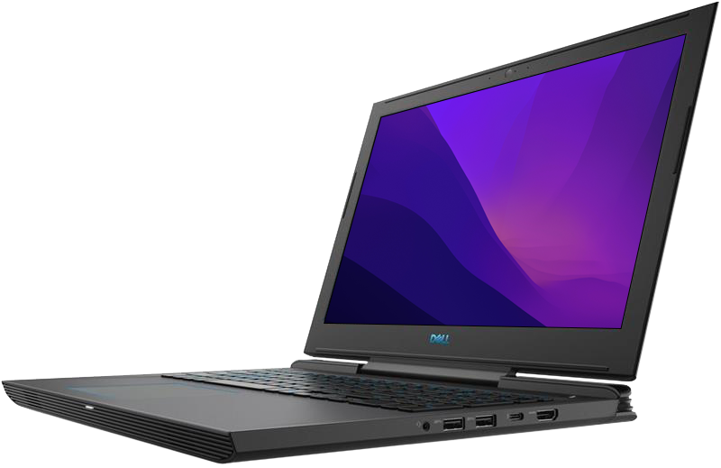

<h1 align="center"> Dell Inspiron G7 7588 Hackintosh </h1>

   &nbsp;&nbsp;
   &nbsp;&nbsp;
   &nbsp;&nbsp;
   &nbsp;&nbsp;

  

This EFI repository contains the files needed to successfully boot into macOS on Dell G7 7588 with Opencore and Clover, also it's very stable now. macOS 12 Monterey works well with Windows 11 in dual boot, even with builtin UEFI Secure Boot with custom secure boot keys (currently OpenCore only). There are probably things that can be improved, so feel free to open issues or even PRs with suggestions or observations.

## Update

* Full changelog is here | [Changelog Archive](https://github.com/aksm-unmei/Dell-Inspiron-G7-7588-Hackintosh/blob/main/Changelog.md)

### Latest changelog

- Update OC 0.7.7.
- Update Clover 5143.
- Update latest kexts.
- Add OpenLinuxBoot.efi, ext4_x64.efi for booting to Linux/Ubuntu.
- Update a folder which contains CPUFriendDataProvider for Core i5 machine.
- Remove NVMeFix.kext for native NVMe's power management.
- Improve HPET's IRQNoFlag.
- Improve RTC's alignment and length values (for better hibernation).
- Remove unnecessary devices in SSDT-PCID.
- Add FWHD device to SSDT-PCID.
- Add PPMC device to SSDT-PCID (_ADR should be Zero. macOS can't detect if _ADR is 0x001F0002 on this machine because it doesn't exist).
- Add ARTC device to SSDT-PCID.
- Rework SSDT-DDGPU, to be paired with SSDT-PTSWAK.
- Improve SSDT-ALS0 for enabling native Ambient Light Sensor device in DSDT.
- Remove USB mapping kexts.
- Remove USB map folder.
- Inject USB mapping ports directly using SSDT-XHC (modified version of OEM SSDT-xh_cfhd4, which means the original one is dropped in config.plist).
- Change inject x86 to realize CPU power management method in SSDT-CPUPM.
- Disable Goodix Fingerprint in SSDT-XHC (better battery life I think).
- Add AudioDxe.efi for boot-chime (enabled by default).
- FileVault 2's setting is enabled by default.
- Update PointerPollMin, PointerPollMax and PointerPollMask values.

## Guide

* For a more friendly reading experience, the guide is now hosted [here](https://aksm-unmei.github.io/hackintosh-guide/dell-g7/).

<h2>Thanks to</h2>

* Acidanthera Team for OpenCore Bootloader and many Kernel Extensions.
* Clover Team for Clover Bootloader.
* Dortania Team for Coffee Lake laptop guide.
* Juan-VC for ALC256 codec dump.
* black-dragon74 for ALCPlugFix-Swift.
* profzei for UEFI Secure Boot and OpenCore guide.

<h2>Support me</h2>

* [Paypal](https://www.paypal.me/tekun0lxrd)
