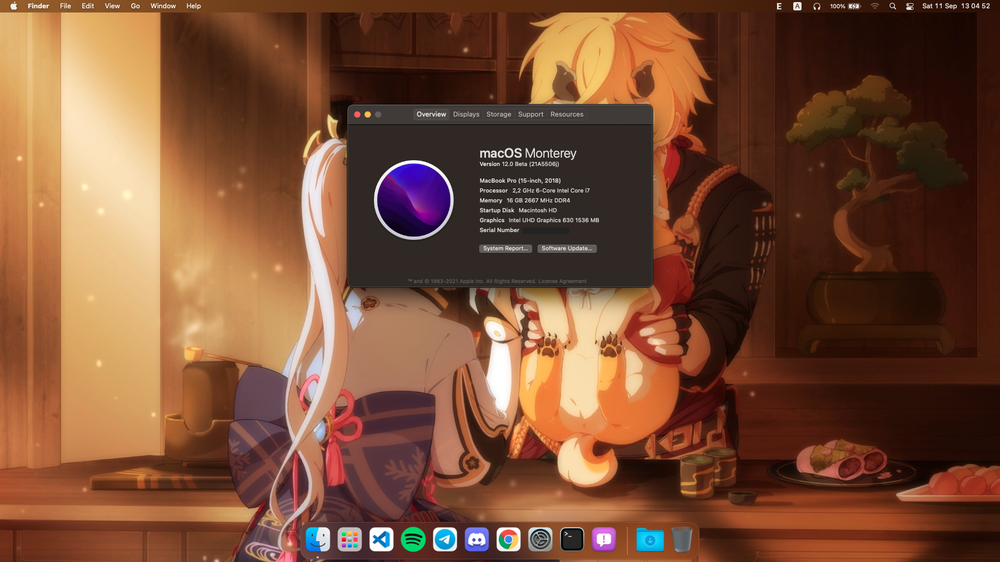

# Dell Inspiron G7 7588 Hackintosh


<p align = "center">
macOS Big Sur
</p>



<p align = "center">
macOS Monterey
</p>

* macOS:
  - Monterey 12.0 Beta 6 🔶
  - Big Sur 11.5.2 ✅
  - Catalina 10.15.7 ✅
* Bootloader: OpenCore 0.7.3, Clover 5139
* EFI can be used for both for installation and booting from SSD.

## Introduction

<details>  
<summary><strong>System Overview</strong></summary>
</br>

**Dell G7 7588**

| Type | Item |
| ---- | ---- |
| CPU | Intel Core i7-8750H @ 2.20 GHz, 9M Cache, up to 4.10 GHz
| RAM | SK Hynix 8GB DDR4-2666MHz HMA81GS6CJR8N-VK, Samsung 8GB DDR4-2666MHz M471A1K43CB1-CTD |
| Monitor Panel | BOE NV156FHM @ 1080p, 144Hz |
| SSD | Western Digital SN730 256GB NVMe Solid State Drive|
| HDD | Seagate 1TB 2.5" 5400RPM Internal Hard Drive |
| Sound | Realtek ALC256/ALC3246 |
| Wireless, Bluetooth | Intel Wireless AC9560 160MHz |
| Integrated GPU | Intel UHD Graphics 630 (GT2) |
| Dedicated GPU | Nvidia GTX 1050Ti (disabled) |
| BIOS Version | 1.16.0 |

</details>

<details>  
<summary><strong>Current Status</strong></summary>

| Feature | Status |
| ------------- | ------------- |
| CPU Power Management | ✅ Working |
| Sleep/Wake | ✅ Working |
| Intel UHD630 Graphics Acceleration | ✅ Working |
| Intel Quartz Extreme and Intel Core Image (QE/CI) | ✅ Working |
| Brightness control slider | ✅ Working |
| Special function keys (audio, brightness, sleep...) | ✅ Working |
| Ethernet | ✅ Working |
| Audio | ✅ Working |
| USB-C Port | ✅ Working |
| Touchpad | ✅ Working |
| Battery | ✅ Working |
| iMessage/Facetime and App Store | ✅ Working  |
| Speakers and Headphones | ✅ Working |
| Built-in Microphone | ✅ Working |
| Webcam | ✅ Working |
| Wi-Fi/Bluetooth | ✅ Working |
| Airdrop/Handoff | ✅ Working |
| FileVault 2 (OpenCore recommended)| ✅ Working |
| SD Card | ❌ Not working |
| Hibernation | ❌ Not working |
| NVIDIA GPU/HDMI Port | ❌ Not working |
| DRM | ❌ Not working |
| Fingerprint reader | ❌ Not working |
| BootCamp | ❌ Not working |

</details>

## Installation

<details>  
<summary><strong>BIOS Configuration</strong></summary>
</br>

**Recommend you should restore the BIOS setting to BIOS Setting first. Then configure the following things:**

  | Sub-menu | Key: Value | Comment |
  | --- | --- | --- |
  | UEFI Boot Path Security | `Disabled` | |
  | Enable Legacy Option ROMs | `Disabled` | Disable will help OpenCore's GUI loaded faster |
  | SATA Operation | `AHCI` | |
  | Enabled USB Boot Support | `Enabled` | |
  | Enable External USB Port | `Enabled` | |
  | Thunderbolt Security | `Enabled` | |
  | Thunderbolt Auto Switch | `Native Enumeration` | |
  | PTT Security | `Disabled` | |
  | Secure Boot Enable | `Disabled` | |
  | Intel SGX | `Disabled` | |
  | VT for Direct I/O: | `Disabled` | |
  | Wake on USB | `Enabled` | Wake from keyboard works correctly |
  | Audo OS Recovery Threshold | `Disabled` | |
  | SupportAssist OS Recovery | `Disabled` ||

</details>

<details>  
<summary><strong>Disable CFG-Lock</strong></summary>
</br>

* Before installing, you should disable CFG-Lock because I have already disabled `AppleXcpmCfgLock` (`KernelXCPM` in Clover) key in `config.plist`.
* Simply just run the `CFGUnlock.efi` tool in OpenCore's GUI, press `Y` and hit Enter. Then reboot the machine. Now you can boot into macOS installation normally.
* For Clover user, you have to run is via `UEFI Shell` tool at Clover's boot menu.

</details>

<details>
<summary><strong>config.plist Configuration</strong></summary>

### Graphic Display
* Integrated Intel UHD Graphics 630 support is handled by WhateverGreen, and configured in the `DeviceProperties` section of `config.plist`.
The NVIDIA GPU is not supported so it is disabled in SSDT.
The default BIOS DVMT pre-alloc value of `64MB` is sufficient and does not need to be changed.
  #### Enable acceleration
  * DeviceProperties/Add/PciRoot(0x0)/Pci(0x2,0x0)
    * `AAPL,ig-platform-id = <0900A53E>`
  #### Fix backlight registers on CoffeeLake platform
  * DeviceProperties/Add/PciRoot(0x0)/Pci(0x2,0x0)
    * `enable-backlight-registers-fix = <01000000>`
  #### Enable external display support
  * DeviceProperties/Add/PciRoot(0x0)/Pci(0x2,0x0)
    * `agdpmod = <vit9696>`
  #### Customize the behavior of the backlight
    * `enable-backlight-smoother = <01000000>`
    * `backlight-smoother-steps = <23000000>`
    * `backlight-smoother-interval = <07000000>`
    * `backlight-smoother-threshold = <2C010000>`

### Audio
* For ALC256 on this G7, I use `layout-id = <0E000000>`, it means `14`.
* Without any modifications, the headphone jack is buggy. External microphones aren't detected and the audio output may randomly stop working or start making weird noises. To permanently fix this issue, please go to [Post-Install](https://github.com/rex-lapis/Dell_G7_7588_OpenCore_Hackintosh#finish) for more information.
  #### Fix audio broken after rebooting from Windows into macOS
  * DeviceProperties/Add/PciRoot(0x0)/Pci(0x1F,0x3)
    * `alctsel = <01000000>`

</details>

<details>
<summary><strong>Other Configuration</strong></summary>

### USB
* From this version, I made a folder about USB ports mapping for somebody who is using Intel or Broadcom wireless card.
* By default, there is no USB kext in bootloader's kext folder. Make sure you have to pick the correct kext(s) depends on what card you are using and save the `config.plist` file.

### Wireless, Bluetooth
* The stock Intel AC 9560 can be worked well with [OpenIntelWireless](https://github.com/OpenIntelWireless).
* There are some Broadcom cards like DW1560, DW1820A, BCM94360NG, which can use AirDrop well, are compatible with this machine. If you have them, this EFI is worked well. Make sure you have to add wireless and bluetooth kexts correctly (except BCM94360NG, this card is native with macOS, **don't use any kexts!**).

### Sleep, Wake and Hibernation
* Hibernation is not supported on a Hackintosh and everything related to it should be completely disabled. Disabling additional features prevents random wakeups while the lid is closed. After every update, these settings should be reapplied manually.
```
sudo pmset -a hibernatemode 0
sudo rm -f /var/vm/sleepimage
sudo mkdir /var/vm/sleepimage
sudo pmset -a standby 0
sudo pmset -a autopoweroff 0
sudo pmset -a powernap 0
sudo pmset -a proximitywake 0
```
* Sleep and wake are improved and very fast now. Also, you can use shortcut key `Fn + Insert` to sleep this machine, likes Windows. For more infomation, please check the [OpenCore 0.6.8](https://github.com/rex-lapis/Hackintosh-Dell-G7-7588-OpenCore/blob/main/Changelog.md#v068) changelog.

### CPU Power Management
* CPU power management is done by `CPUFriend.kext` while `CPUFriendDataProvider.kext` defines how it should be done. `CPUFriendDataProvider.kext` is generated for a specific CPU and power setting. The one supplied in this repository was made for the i7-8750H. In case you have another CPU, you should follow [this guide](https://dortania.github.io/OpenCore-Post-Install/universal/pm.html) to generate your own `CPUFriendDataProvider.kext`.

</details>

<details>
<summary><strong>iServices</strong></summary>

* To use iMessage and other Apple services, you need to generate your own serial numbers. This can be done using [CorpNewt's GenSMBIOS](https://github.com/corpnewt/GenSMBIOS). Make sure model is `MacBookPro15,1`. Then, go [Apple Check Coverage page](https://checkcoverage.apple.com/) to check your generated serial numbers. If the website tells you that the serial number **is not valid**, that is fine. Otherwise, you have to generate a new set.

* Next you will have to copy the following values to your `config.plist`:
  - Serial Number -> `PlatformInfo/Generic/SystemSerialNumber`.
  - Board Number -> `PlatformInfo/Generic/MLB`.
  - SmUUID -> `/PlatformInfo/Generic/SystemUUID`.
  Reboot and Apple services should work.

* If they don't, follow [this in-depth guide](https://dortania.github.io/OpenCore-Post-Install/universal/iservices.html). It goes deeper into ROM, clearing NVRAM, clearing Keychain (missing this step might cause major issues), and much more.

</details>

<details>
<summary><strong>Finish</strong></summary>

* There is a script file in `Post-Install` folder. Move it to `Desktop` and run after you're already finished installing macOS. It will help to fix the output and input audio when you plug 3.5mm headphone/headset/external speaker in, and disable hibernation for enhancing sleep.

</details>

## Credit
* Apple for macOS.
* Acidanthera Team for OpenCore and many Kernel Extensions.
* Clover Team for Clover.
* Dortania Team for Coffee Lake Laptop guide.
* Ivs1974 for ComboJack Fix.

## Support
* Support me: 
  - [Paypal](https://www.paypal.me/tekun0lxrd)
